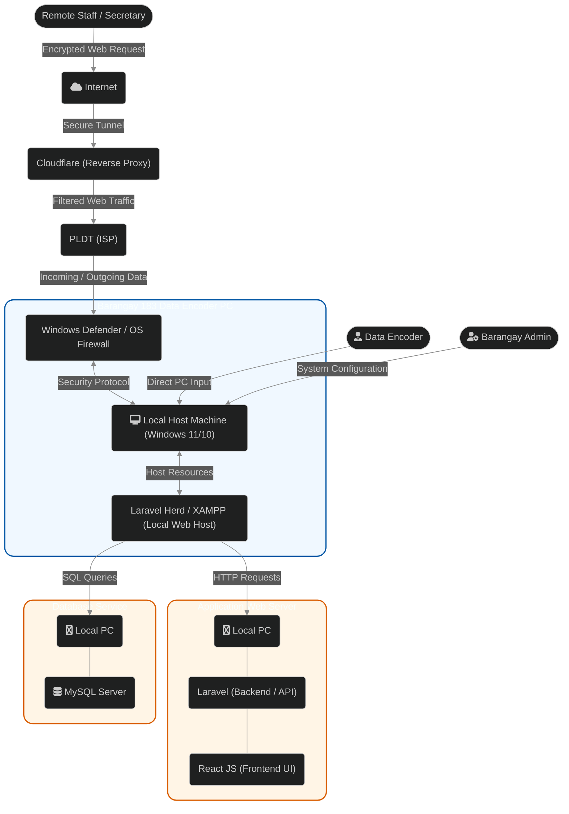
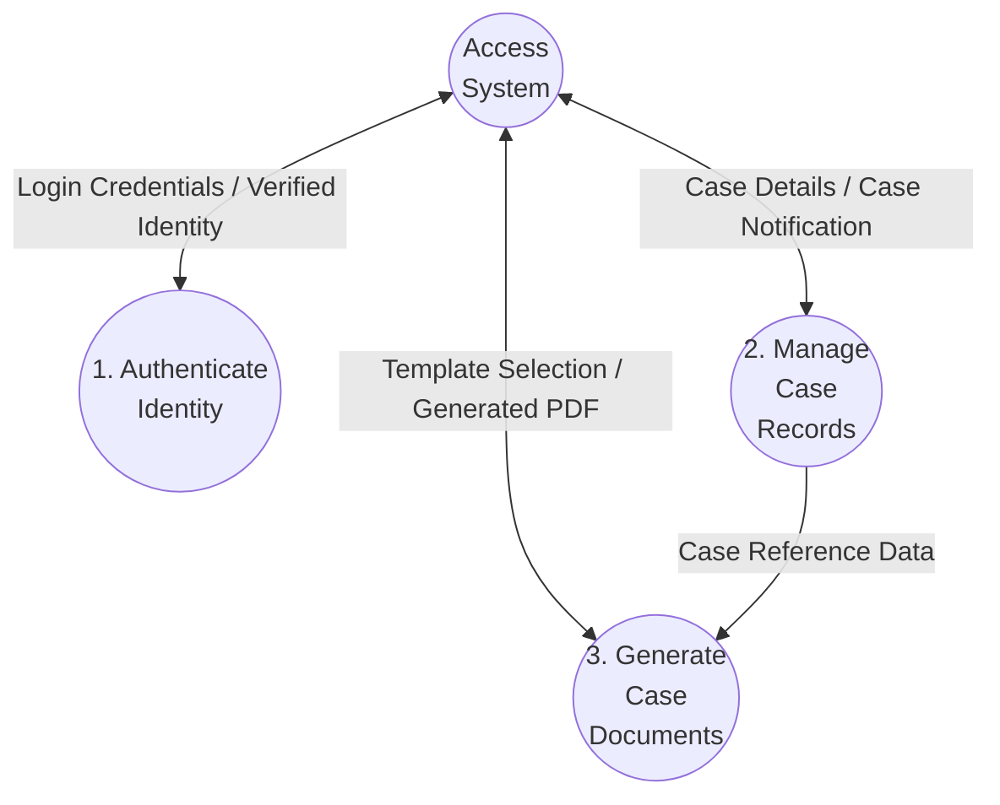
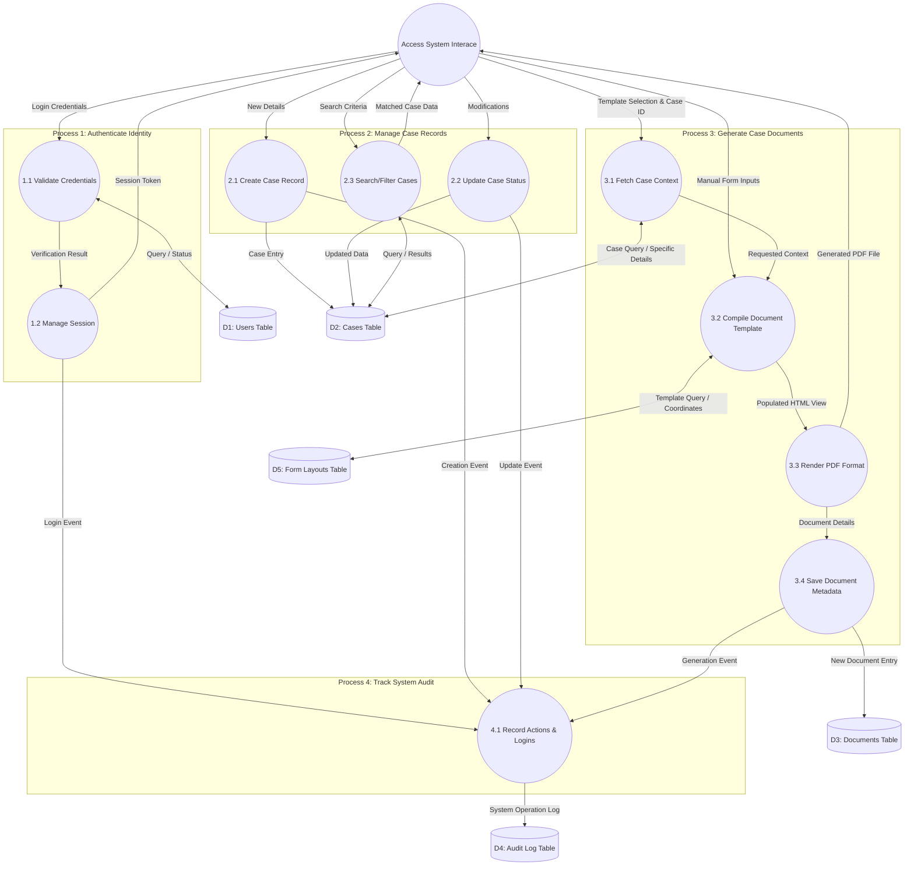
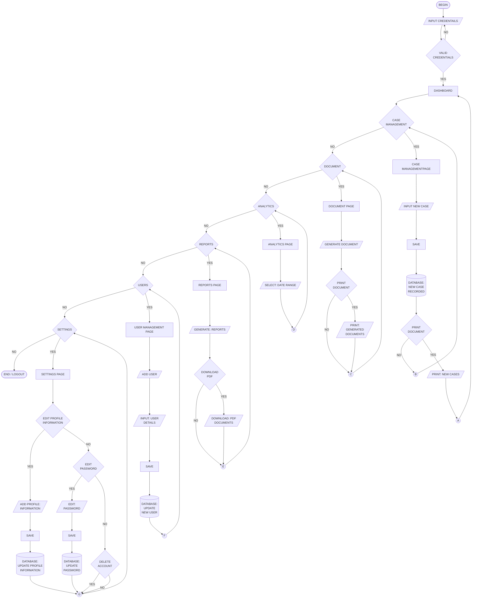

# System Diagrams for Lupon Tagapamayapa Case Management System

Here are the requested diagrams based on the system's current functionality, focusing on your specific rules:
- **Arrows/Data Flows = Nouns** (e.g., "Generated PDF", "Case Details")
- **Processes/Entities = Verbs/Actions** (for processes) or Nouns (for database tables/external entities).

## 1. System Architecture / Environment Diagram (Context)

This diagram mirrors the structure of your example, illustrating the physical/logical components like servers, firewalls, and the local tech stack (Laravel, React, MySQL), rather than just the flow of data.

## 2. Data Flow Diagram (DFD) Level 0

This breaks down the "Process Lupon System" into its core major processes. Notice that the authentication process acts as a gateway; it must generate a "Session Token" which is then required as input data for all subsequent processes to function. All processes are verbs and data flows are nouns.

## 3. Data Flow Diagram (DFD) Level 1 (Full System Detail)

This expands on *every* process from Level 0, providing a much higher level of detail for the entire system, while maintaining the rule that processes are verbs and data flows are nouns.

## 4. Procedural Diagram / Flowchart (Full System Lifecycle)

This diagram shows the end-to-end, high-level sequential logic of a user interacting with the Lupon Case Management System, keeping processes as verbs and the data/control flows as nouns (or conditions).

